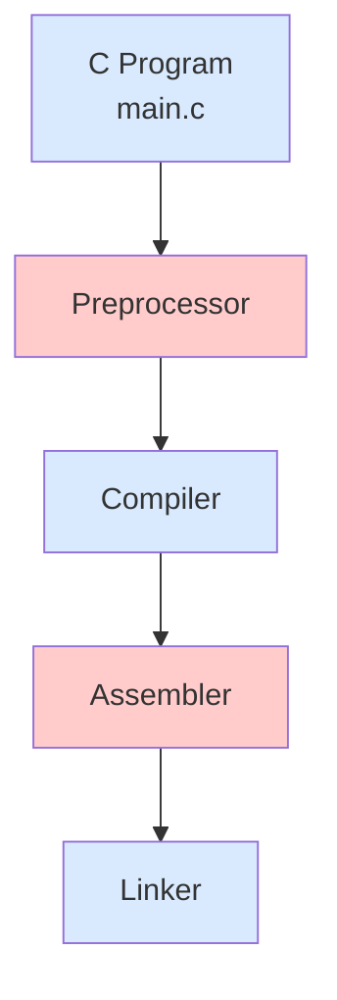

## Compilation Process

The compilation of a source code on a finally executable involve multiple steps which are:

Preprocesamiento:
- Procesa directivas como #include, #define y #ifdef
- Elimina comentarios
- Expande macros
- Incluye archivos de cabecera (.h)
- Genera código fuente expandido (.i)

Compilación:
- Traduce el código C a código ensamblador
- Realiza análisis léxico, sintáctico y semántico
- Optimiza el código
- Genera archivo de código ensamblador (.s)

Ensamblado:
- Convierte el código ensamblador a código objeto
- Traduce instrucciones a código máquina
- Genera archivo objeto (.obj o .o)

Enlazado:
- Combina múltiples archivos objeto
- Resuelve referencias a funciones externas
- Incorpora bibliotecas estáticas y dinámicas
- Produce el archivo ejecutable final (.exe)

## Example
- Procesa directivas como #include, #define y #ifdef
- Elimina comentarios
- Expande macros
- Incluye archivos de cabecera (.h)
- Genera código fuente expandido (.i)

Probando

### Step 1: Preprocessor

g++ -o mi_programa compilation_example.o -lm -Wl,--verbose

ld --hash-style=gnu \
   --build-id \
   --eh-frame-hdr \
   -m elf_x86_64 \
   -dynamic-linker /lib64/ld-linux-x86-64.so.2 \
   -o mi_programa \
   /usr/lib64/crt1.o \
   /usr/lib64/crti.o \
   /usr/lib/gcc/x86_64-redhat-linux/11/crtbegin.o \
   -L/usr/lib/gcc/x86_64-redhat-linux/11 \
   -L/usr/lib64 \
   -L/lib64 \
   compilation_example.o \
   /usr/lib/gcc/x86_64-redhat-linux/11/libstdc++.so \
   /lib64/libm.so.6 \
   /lib64/libmvec.so.1 \
   /lib64/libgcc_s.so.1 \
   /usr/lib/gcc/x86_64-redhat-linux/11/libgcc.a \
   /usr/lib64/crtn.o64-redhat-linux/11/crtend.o \