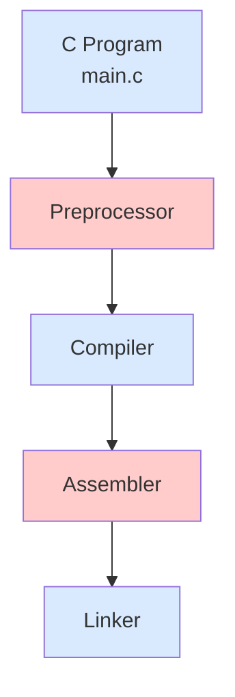

## Compilation Process

The compilation of source code into a final executable involves multiple steps which are:

**Preprocessing:**
- Processes directives like #include, #define and #ifdef
- Removes comments
- Expands macros
- Includes header files (.h)
- Generates expanded source code (.i)

**Compilation:**
- Translates C code to assembly code
- Performs lexical, syntactic and semantic analysis
- Optimizes the code
- Generates assembly code file (.s)

**Assembly:**
- Converts assembly code to object code
- Translates instructions to machine code
- Generates object file (.obj or .o)

**Linking:**
- Combines multiple object files
- Resolves references to external functions
- Incorporates static and dynamic libraries
- Produces the final executable file (.exe)

## Example

### Extended code generation
The example file **example.cpp** in this folder contains the use of preprocessor directives to better illustrate this step. First, create the example.i file with the following command `g++ -E example.cpp -o example.i`. Take a look at the code (at the final part, which contains our code) and then generate it again with the following command `g++ -E example.cpp -DCHANGE_PREPROCESSOR -o example.i`. Now review it again. Do you notice differences? Can you explain what happened?

### Assembly generator
Subsequently, you can create the assembly code using the command `g++ -S example.i -o example.s`. Now review the resulting assembly code. What does this assembly code depend on? Are there ways to generate other types of assembly code?

### Object file
To generate the object code, which is no longer readable by humans, you can do it with the command `g++ -c example.s -o example.o`. What would the process be like if instead of the `g++` command we used the GNU assembler?

### Linking process
Finally, to obtain the final executable, do it using the wrapper `g++ example.o -o example.out`. Are you able to link the object file using the `ld` linker directly? Try to figure out how to do it. One possible solution involves seeing what flags it uses when doing the entire process with the `g++` wrapper and then trying to replicate it. For this, some very useful flags are `-lm -Wl,--verbose`