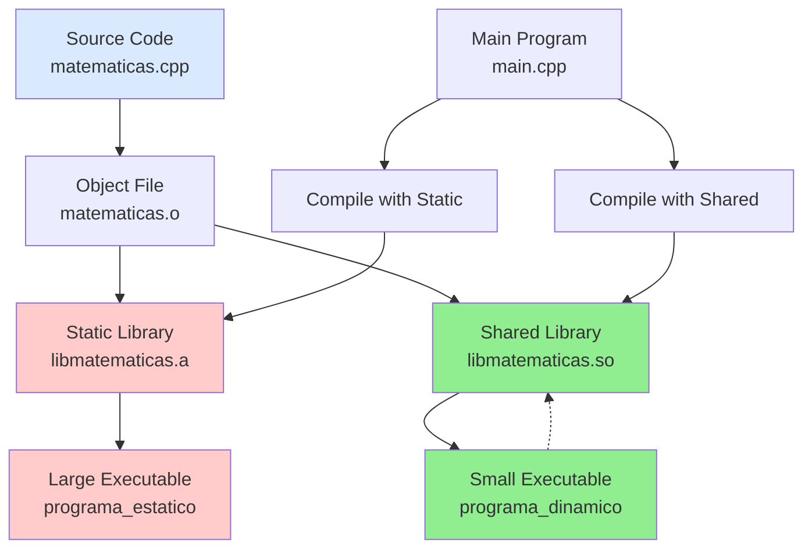

# Static and Shared Libraries in C++

Libraries are pre-compiled code that can be reused across multiple programs. There are two main types of libraries that differ in how they are linked and used:



**Static Libraries (.a files):**
- Incorporated completely into the executable during compilation/linking
- Each program using the library has its own integrated copy
- Larger executable size but no external dependencies
- Created using the `ar` (archiver) tool

**Shared Libraries (.so files):**
- Loaded into memory only when needed during execution
- Multiple programs can share the same library copy in memory
- Smaller executable size but requires library to be present on target system
- Created using the `-shared` flag with the compiler

## Static Library Creation

### Step 1: Compile source to object file
First, compile the library source code into an object file:
```bash
g++ -c matematicas.cpp -o matematicas.o
```

### Step 2: Create static library
Use the archiver tool to create the static library:
```bash
ar rcs libmatematicas.a matematicas.o
```
The flags mean: `r`=insert files, `c`=create archive if it doesn't exist, `s`=write an index

### Step 3: Compile main program with static library
Link the main program with the static library:
```bash
g++ main.cpp -L. -lmatematicas -o programa_estatico
```
The flags mean: `-L.`=look for libraries in current directory, `-lmatematicas`=link with libmatematicas.a

### Step 4: Run the program
Execute the statically linked program:
```bash
./programa_estatico
```

## Shared Library Creation

### Step 1: Compile with position-independent code
Compile the source with the `-fPIC` flag (required for shared libraries):
```bash
g++ -fPIC -c matematicas.cpp -o matematicas.o
```

### Step 2: Create shared library
Create the shared library using the `-shared` flag:
```bash
g++ -shared -o libmatematicas.so matematicas.o
```

### Step 3: Compile main program with shared library
Link the main program with the shared library:
```bash
g++ main.cpp -L. -lmatematicas -o programa_dinamico
```

### Step 5: Run the program
Execute the dynamically linked program:
```bash
./programa_dinamico
```

## Verification and Analysis

### View executable dependencies
Check what shared libraries an executable depends on:
```bash
find ./nombre-del-ejecutable -type f -perm /a+x -exec ldd {} \; \
| grep so \
| sed -e '/^[^\t]/ d' \
| sed -e 's/\t//' \
| sed -e 's/.*=..//' \
| sed -e 's/ (0.*)//' \
| sort \
| uniq -c \
| sort -n
```

### Compare executable sizes
See the difference in file sizes between static and dynamic linking:
```bash
ls -la
```

### Examine library symbols
View the symbols contained in the libraries:
```bash
nm libmatematicas.a      # Static library symbols
nm -D libmatematicas.so  # Shared library symbols
```

### Verify library contents
List the object files contained in the static library:
```bash
ar -t libmatematicas.a
```

### Compiler preference
By default the compiler prefer compile with shared libraries, if both are find the compiler by default will use the shared library, you can use the flag `-static`, for use the static version.

The flag before force all the libraries static, then you need a static version of the standart library, for a selective static compilation on our example you can use 
```bash
g++ main.cpp -L. -Wl,-Bstatic -lmatematicas -Wl,-Bdynamic -o programa_estatico
```

https://gcc.gnu.org/onlinedocs/gcc-12.1.0/gcc/Link-Options.html

### Question
Can you create both versions of the library and compare their sizes? What differences do you notice when using `nm` to examine the symbols? Try running `objdump -t` on both library types - what additional information does this provide about the object file structure?